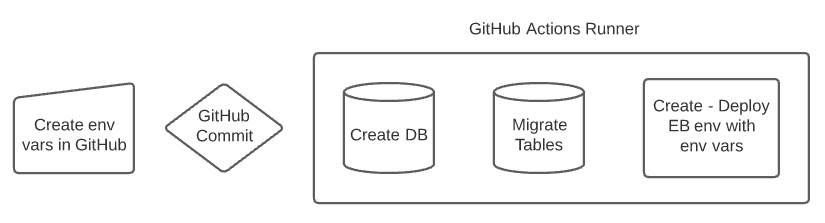

# Flask CI/CD on Elastic Beanstalk
This is a CI/CD deployment of a Flask application in AWS using RDS PostgreSQL as the database

### Technologies
Python 3.8, Flask, AWS RDS - PostgreSQL, GitHub, GitHub Actions, AWS Code Pipeline, AWS
Elastic Beanstalk

### Demo Videos

## Objective
To create a production quality web application deployment pipeline. This pipeline automatically
deploys a simple Flask application to AWS upon commit to the master branch on GitHub.

In addition, I’ve compared GitHub Actions and AWS Code Pipeline by designing the pipeline with
each tool.

## Benefits
CI/CD eliminates change management pain and human error. With a process like this, code can be automatically tested and
deployed.

## Architecture


## About Elastic Beanstalk
Elastic Beanstalk is an application deployment service. According to the [documentation](https://docs.aws.amazon.com/elasticbeanstalk/latest/dg/create-deploy-python-flask.html),
Elastic Beanstalk will create the following objects:

 - EC2 instance – An Amazon Elastic Compute Cloud (Amazon EC2) virtual machine configured to run web apps on the platform that you choose.
 - Instance security group – An Amazon EC2 security group configured to allow inbound traffic on port 80. This resource lets HTTP traffic from the load balancer reach the EC2 instance running your web app. By default, traffic isn't allowed on other ports.
 - Load balancer – An Elastic Load Balancing load balancer configured to distribute requests to the instances running your application. A load balancer also eliminates the need to expose your instances directly to the internet.
 - Load balancer security group – An Amazon EC2 security group configured to allow inbound traffic on port 80. This resource lets HTTP traffic from the internet reach the load balancer. By default, traffic isn't allowed on other ports.
 - Auto Scaling group – An Auto Scaling group configured to replace an instance if it is terminated or becomes unavailable.
 - Amazon S3 bucket – A storage location for your source code, logs, and other artifacts that are created when you use Elastic Beanstalk.
 - Amazon CloudWatch alarms – Two CloudWatch alarms that monitor the load on the instances in your environment and that are triggered if the load is too high or too low. When an alarm is triggered, your Auto Scaling group scales up or down in response.
 - AWS CloudFormation stack – Elastic Beanstalk uses AWS CloudFormation to launch the resources in your environment and propagate configuration changes. The resources are defined in a template that you can view in the AWS CloudFormation console.
 - Domain name – A domain name that routes to your web app in the form subdomain.region.elasticbeanstalk.com.

## Elastic Beanstalk Expectations for Flask
Elastic Beanstalk (EB) is particular in how your app is structured and named. To keep it simple, you are stuck with having 
the following structure/naming. 

```
├── applicaion
│   ├── __init__.py
│   └── othercode.py
├── Pipfile.lock
└── application.py
```
Along with this structure, the application variable itself should be called "application". To quote the documentation:

"Using application.py as the filename and providing a callable application object (the Flask object, in this case) allows 
EB to easily find your application's code. "

In theory, you can change some of these names (the application.py for example can be set with the WSGIPath in app.config), 
but I found it to be more effort than it is worth. That being said, having many things named the same was also problematic.

This was by far the trickiest part of the whole pipeline. Flask would always run locally perfectly, but EB could not 
find/import the application to run. Many examples use just one application.py file, which is simple and easy.
However, no real world application would be one file, so I wanted to use a package structure, and that complicated 
everything. I am still a bit confused what exactly EB runs when it loads the application. It doesn't just run  `python 
application.py`. It requires that, but somewhere, gunicorn (the WSGI web server) also imports application using a call
similar to application:application, which confuses things when it has a both a module and package called application in the
structure. You would think an import would reference the package, but clearly this process works when only one script exists.
In any case, if you have a simple one-script app (no package), you can set the WSGIPath to "application.py", 
but if you have a package it has to be set to just "application". Somehow that magic lets it both run and gunicorn to 
correctly import it. 

## Pipeline Overview
#### GitHub Actions Pipeline Overview
1. Commit to the master branch of a GitHub repository (pull request ideally).
2. GitHub actions will then create the database or migrate and changes. 
3. GitHub actions will then deploy the repository to Elastic Beanstalk. This creates the server environment.
   - During the create, it creates the environment variables in the environment from GitHub stored secrets.
4. Once the database is created, the application is ready to use via the Elastic Beanstalk endpoint.



#### AWS CodePipeline Pipeline Overview
1. Create the application and environment in Elastic Beanstalk. Also define environment variables.
2. Commit to the master-aws branch of a GitHub repository (pull request ideally).
3. CopePipline will deploy the application, in which Python will create the database if it doesn't exist.
4. The postdeploy application hook will then migrate any changes and restart the app.
5. The application is now ready to use via the Elastic Beanstalk endpoint.


## Database Considerations
Elastic Beanstalk does have the [option](https://docs.aws.amazon.com/elasticbeanstalk/latest/dg/using-features.managing.db.html) 
to configure an integrated RDS DB instance as part of the deployment process.

However, I chose to manage the database within Python. Initially I chose Python for the level of control. I still like
this path, but looking back I'm not sure there is a significant difference between handling it myself in python vs 
using options in teh aws:rds:instance namespace. Using Python you have the full control of the rds client api, and I
don't believe all of those are available in the namespace. For example, in Python I was able to specify a security group, 
which ended up being a nice feature, to be able to have a static (not-auto-created) group. However, using the config
the groups might all create correctly if you have no need to have them static (not destroyed when you delete the EB env). 
I noticed the EB integrated RDS does also have the option to persist/decouple the database after app deletion, which is 
a nice option to have and puts it more on par with what I did in Python.

I chose PostgreSQL just because it is a nice option. 

## Configuration Considerations
The configs will cleanly allow you to change between local, dev, test, and prod environments.

Most configs are included in the .env file. I've included a env_template that you would just need to fill out and rename to .env.
- You always need an APP_SECRET for Flask encryption.
- You always need FLASK_APP set to the name of your Flask application ("application" in this case) for Flask-Migrate to
  work correctly.
- You always need FLASK_APP set to application for Flask-Migrate to correctly find the app.
- If you want to develop locally, you would need PostgreSQL installed, set LOCAL_DEVELOPMENT=True and include LOCAL_USER
and LOCAL_PW.
- To develop on AWS you need to set all of the AWS* variables.

When using GitHub Actions, you need to set up all of the above env variables 
[within Gihub.](https://docs.github.com/en/actions/deployment/targeting-different-environments/using-environments-for-deployment)

For this demo, I just used repository secrets and my master branch. You could easily use environments, but you would 
need to edit the main.yml and create different workflows for different branches + environment. 

Elastic Beanstalk knows what env vars to expect based on the .ebextensions > environment.config. This is nice for 
environment variables that might change but are not actually secret. Technically you don't need to have the placeholders
here since the main.yml will create them upon deployment, but I kept them all for consistency. If you create a new env var
that isn't sensitive, you can only add it just in environment.config. If you add a new sensitive secret, you could add
it only within GitHub and within the main.yml. You do NOT want to add secrets to your environment.config, because this file
is committed to the repo.

If you were going to use this in production, you would probably want to change some of the create_db options in database.py.

## How To Run Locally

1. Clone, or fork and clone this repo.
    ```commandline
    git clone https://github.com/Karana316/flask-aws-tutorial
    ```

2. Configure your environment (commands run from flask_aws_tutorial folder)
   - I suggest using pipenv. You could use venv and install the requirements.txt just the same.
    ```
    $ pipenv install
    ```
   - [Install PostgreSQL](https://www.postgresqltutorial.com/install-postgresql-linux/) according to your OS and set up 
     a user and password (or use the default of your system user/pw). Create a database named flask_db (or change the 
     connection string in config.py).

   - Make sure your .env is filled out for local development  
     - LOCAL_DEVELOPMENT=True  
     - LOCAL_USER: User you create in local installation of PostgreSQL/PGAdmin
     - LOCAL_PW: Password you create in local installation of PostgreSQL/PGAdmin 

3. Update the database  
   - When initially creating the repo, I ran 
    ```commandline
    $ flask db init
    $ flask db migrate -m "Initial migration."
    ```
    These created the migrations folder and an initial "create table" migration. Since these already exist, and you already 
    created the database locally, you only need to run the upgrade command below to run the inital migration to create the tables.
    ```commandline
    $ flask db upgrade
    ```
   - Note: if you don't want to use Flask-Migrate for testing, change the few lines in __init__.py according to the
    comments there. If you do this, you won't need the `flask db upgrade` step after the db creates but before the app
    will run, Python will take care of it all.

4. Run the application. View in your browser at http://127.0.0.1:5000.
    ```commandline
    $ pipenv shell
    $ python application.py
    ```
The running app looks like this, with an input field to input data to the "Data" table, and a numeric imput field to
retrieve that number of rows from the "Data" table. The sreen caps are from an AWS instance, if you run locally you will
just have the local IP in the address bar.


## How To Run the app locally, but the db on AWS
Complete the same steps as Locally above, except make sure your .env is filled out for AWS development. Once you run the application, it will
take 5 minutes or so for the db to create in RDS.

- LOCAL_DEVELOPMENT=False
- AWS_USER: This can be anything. It is the user that will be created to connect to your db  
- AWS_PW: This can be anything. It is the password that will be created to connect to your db  
- AWS_DB: This can be anything. It will be the name of your database. Note there are naming restrictions, only letters and 
underscores I believe.
- AWS_INSTANCE: this can be anything, it will be the name of the instance your db will be created on. Note there are naming 
  restrictions, only letters and dashes I believe.
- AWS_SECRET_ACCESS_KEY: Create a programmatic user in IAM to get Access Key and ID. Make sure it has permissions to create
  RDS instances.
- AWS_ACCESS_KEY_ID:  Create a programmatic user in IAM to Access Key and ID. Make sure it has permissions to create
  RDS instances.
- AWS_DB_SECURITY_GROUP_ID: Create a security group, let's call it flask-aws-db-sg, in EC2 with an inbound rule for 
  PostgreSQL (port 5432) to accept traffic from your IP (outbound can be left to all traffic allowed). Set this variable 
  to the Security Group ID of the group.
 
There is only one step to change/insert. I'll call it step 2.5, to be run between step 2 and 3. This is because the database
must exist before you can run step 3, which creates the tables.

2.5. Run the application as in step 5 (and stop it once it is fully running with the db created), or just run the following line to kick of the database create, so that it exists
   for the table creation in step 4.
   ```commandline
    python -c "from application.database import AWSPostgreSQL; AWSPostgreSQL()"
   ```

## How To Run on AWS via GithubActions
1. Fork this repo
2. Set up environment/repository variables for all variables in the AWS step above.
   - Create another security group in EC2. Name it flask-aws-eb (if you name it something else, change it in 
     .ebextensions > app.config).
    Inbound rules should be HTTP for all traffic (outbound can be left to all traffic allowed).
   - Add a new inbound rule to the previously created to flask-aws-db-sg. This should be PostgreSQL (port 5432) for all
     traffic. I previously had this limited to the flask-aws-eb security group, but I had to open it up when I decided
     to use Flask-Migrate and have GitHub create the database and migrate it.
3. Commit or pull request a change to the master branch. It will take 5-10 mins to set eveything up, and then you should
see the app and environment in Elastic Beanstalk and the db in RDS. From the environment in Elastic Beanstalk, you can
find the endpoint and/or Open the application from the left menu.

## How To Run on AWS via CodePipeline
For this I used the Console.

### Create the application and environment in Elastic Beanstalk
1. In AWS Console, go to Elastic Beanstalk and click Create Application. Name it flask-aws and choose Python as the
platform. It currently defaults to what we want, which is Python 3.8 running on 64bit Amazon Linux 2.
2. Choose to leave the app as the sample application and click Create Application.
3. This has created both an application and an environment.

The problem with the pipeline below is that there is no place to set the environment during deployment. The database
will not be created without the environment variables it requires. Therefore, we need to set them manually.

1. Go to the Flaskaws-env and choose Configuration on the left. Then Edit on the right of the Software row.
2. Scroll down and add all environment variables, then Apply.

### Create the Code Pipeline
1. In AWS Console, go to CodePipeline and click Create Pipeline.
2. Name the pipeline and let it create a new service role. Don't worry about Advanced Settings. Click Next.
3. On the next page, choose GitHub (Version 2) as the Source provider. If you don't have a connection set up, you will 
click Connect to GitHub, login, and allow the app access to the repo.
4. Choose flask-aws-tutorial as the repository and master-aws as the branch. I created a copy of my master branch so 
that GitHub Actions would stay separate during testing.
5. Leave the box checked that says "Start the pipeline on source code change". We want this to happen. And then choose the
CodePipeline default for the output artifact format. Click Next.
6. Skip the build stage.
7. For Deploy, choose AWS Elastic Beanstalk. Choose the Application name and Environment name you created in Elastic Beanstalk. Click Next.
8. Review and create pipeline.

Note that for testing, you can start the pipeline by clicking Release Change from the Pipelines or flask-aws pipeline screens. 

### File Differences on master-aws branch 
 - There is no environment.config. This is because this file would overwrite the variables we
just set up manually with the placeholders. Since this step is fully manual, we don't need it.
 - There is an additional .platform/hooks/postdeploy/db_init.sh file. This hook will run once the application finishes
deploying. When the application first deploys, it will create the database, but it will contain no tables. This hook will run the
```flask db upgrade``` step after the app is deployed. I left it as a platform post deploy hook (which requires an
app restart after it runs), rather than a config post deploy hook (which would require no restart) to be sure of the timing,
and because it wasn't running correctly as a confighook. Ideally in the end it would run without having to restart the app.

There are many options for hooks and application extensions. I found [this blog](https://github.com/equivalent/scrapbook2/blob/master/archive/blogs/2016-08-22-aws-elasticbeanstalk-hooks.md)
and [this document](https://docs.aws.amazon.com/elasticbeanstalk/latest/dg/platforms-linux-extend.html) very helpful. And
the full list of namespace config options for the .ebextenstions files can be found [here](https://docs.aws.amazon.com/elasticbeanstalk/latest/dg/command-options-general.html).

## GitHubActions or AWS CodePipeline?
I have a feeling it would be possible to better automate the environment setup within CodePipeline. I'm not sure where
you would store you env file, maybe S3? Or maybe you could just automate creating it in the environment from a local copy.
I am sure you could automate creating the environment too, either from local, or during the build step somehow. I didn't
try CodeBuild, so I'm not sure how customizable it is. All this to say, if you don't know and use GitHub, and you are already
in the AWS world, CodePipeline might be a good option for you. I would say the Console/GUI based pipeline is simpler, but in 
reality it just means you will do yml and sh customization tasks in config files.

Overall GitHub Actions wins this comparison by a landslide. You have all the options you have within CodePipeline plus 
more. It is more customizable because you have low-level access to create steps on the runner itself, not just within
the Elastic Beanstalk deployment. Plus the config nicely lives in your repo, and you can centralize your environments.
In addition, GitHub Actions has great error logs for debugging. The CodePipeline UI felt clunky after the ease of 
GitHub Actions.

## Continued Development

### Code Changes
Just commit to your repo. Ideally this is on a dev branch, and pull-request into the master/main.

### Database Changes
As you make changes that affect the database, you will need to create new migrations. 
```commandline
$ flask db migrate -m "another migration." 
```
Review the script it creats within the migrations > versions folder. Add/commit new migrations to the repo, and the pipeline 
will migrate the changes. [Documentation](https://flask-migrate.readthedocs.io/en/latest/index.html) for Flask-Migrate. Note
that Flask-Migrate tracks migrations in a table of its own, so it will not run the same migration twice (when another container
instance spins up for example).

### Package Changes
Note if you make changes in pipenv, re-lock the requirements.txt or remove it. Elastic Beanstalk on Amazon Linux 2
supports both, and the 
[precendence](https://docs.aws.amazon.com/elasticbeanstalk/latest/dg/python-configuration-requirements.html) 
order is requirements.txt and then Pipfile.lock.
```
$ pipenv lock -r > requirements.txt
```

## Future Improvements
There are two additional steps that would be necessary for a production application.

### The Build step with testing
I left this step in GitHub actions, but the testing piece is commented out, so it isn't doing much
other than testing the installation. Generally you would run unit tests in this step, but that is difficult to do with my current
setup. You don't want to test with the real database, so you would probably want to write tests against a local (to the
test runner) PostgreSQL install or an in-memory SQLite db. This was just out of scope for this project. For AWS you would
use CodeBuild for this piece, which was also out of scope.

### Refine AWS security if using GitHub
I chose to use a username and password for my database creation. This might be better handled use the IAM role option. 
Since I have github actions create the database first if it doesn't exist, I had to leave port 5432 open on the database
role. Maybe if you switched to IAM security you could create a more specific policy/role. In any case, the security needs
to be tightened down. Of course if you have an enterprise GitHub account, you probably have a custom runner that you can
more easily know the IP of (to add to the security group).

## Sources
I started this project by forking [this repo](https://github.com/inkjet/flask-aws-tutorial), but ended up making 
significant changes to the Python structure. I looked to [here](https://github.com/cookiecutter-flask/) for structure suggestions.

The GitHub actions came mainly from [here](https://python.plainenglish.io/deploy-a-python-flask-application-to-aws-elastic-beanstalk-55fb39f4903a).
I only had to make the minor changes of excluding the test step, adding the db create step, and adding the environment 
portion of the eb create. 


